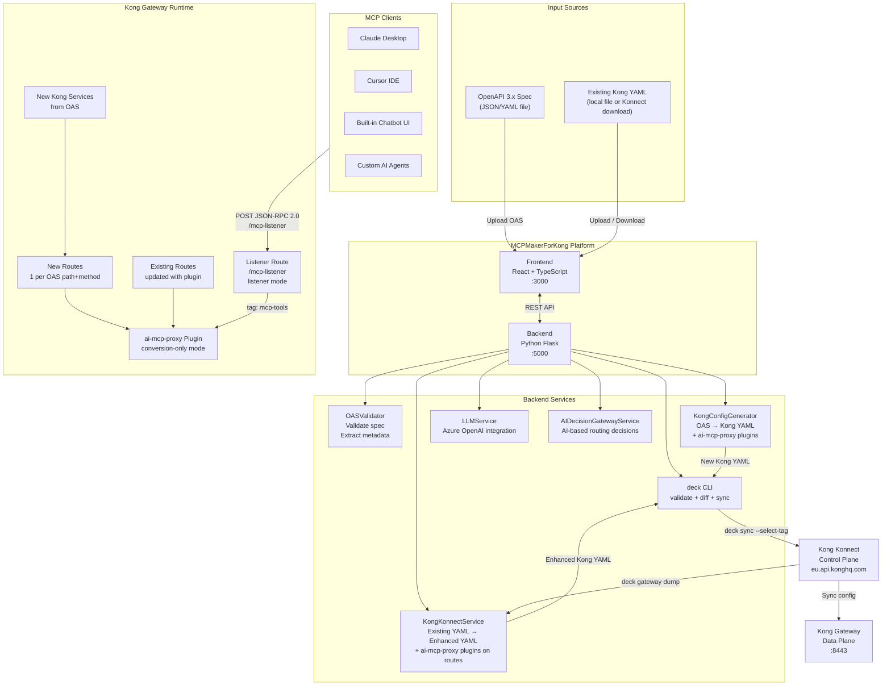
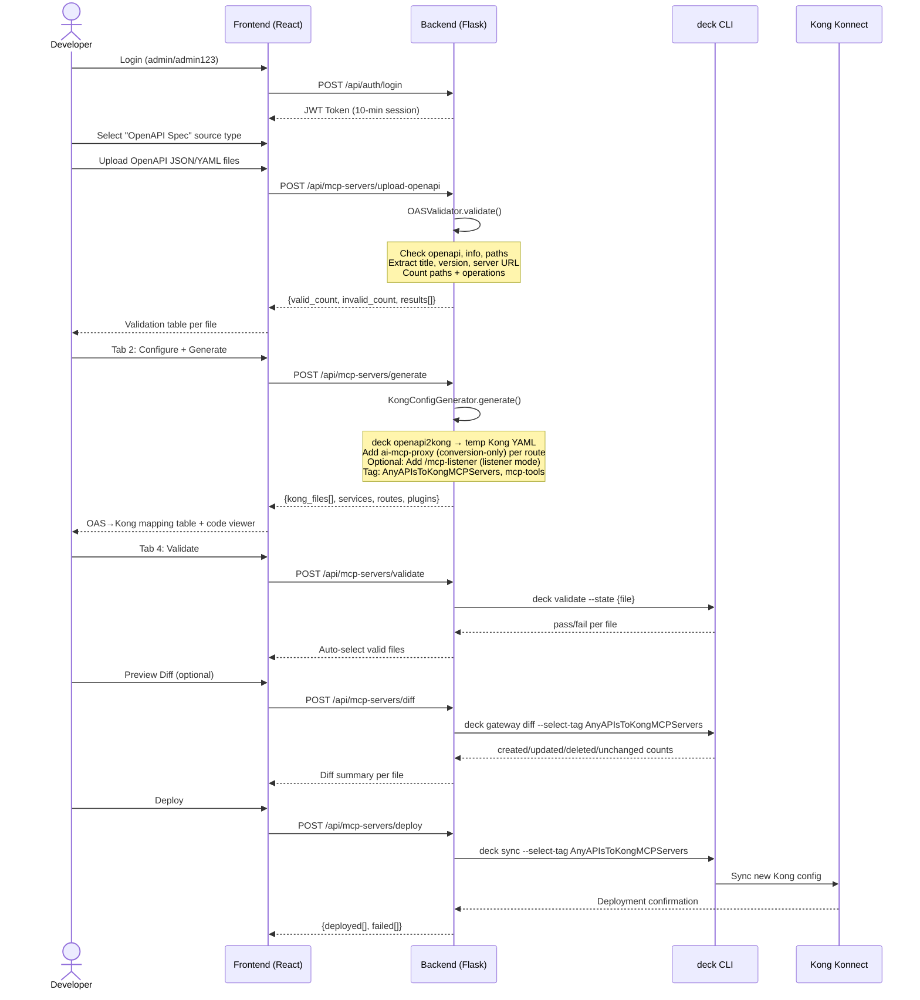
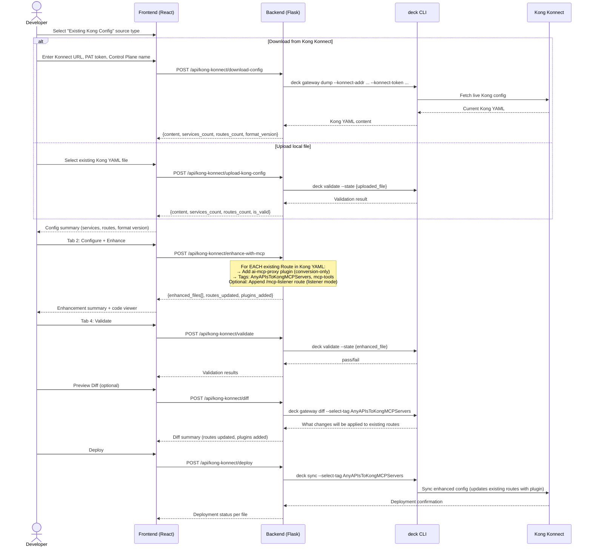
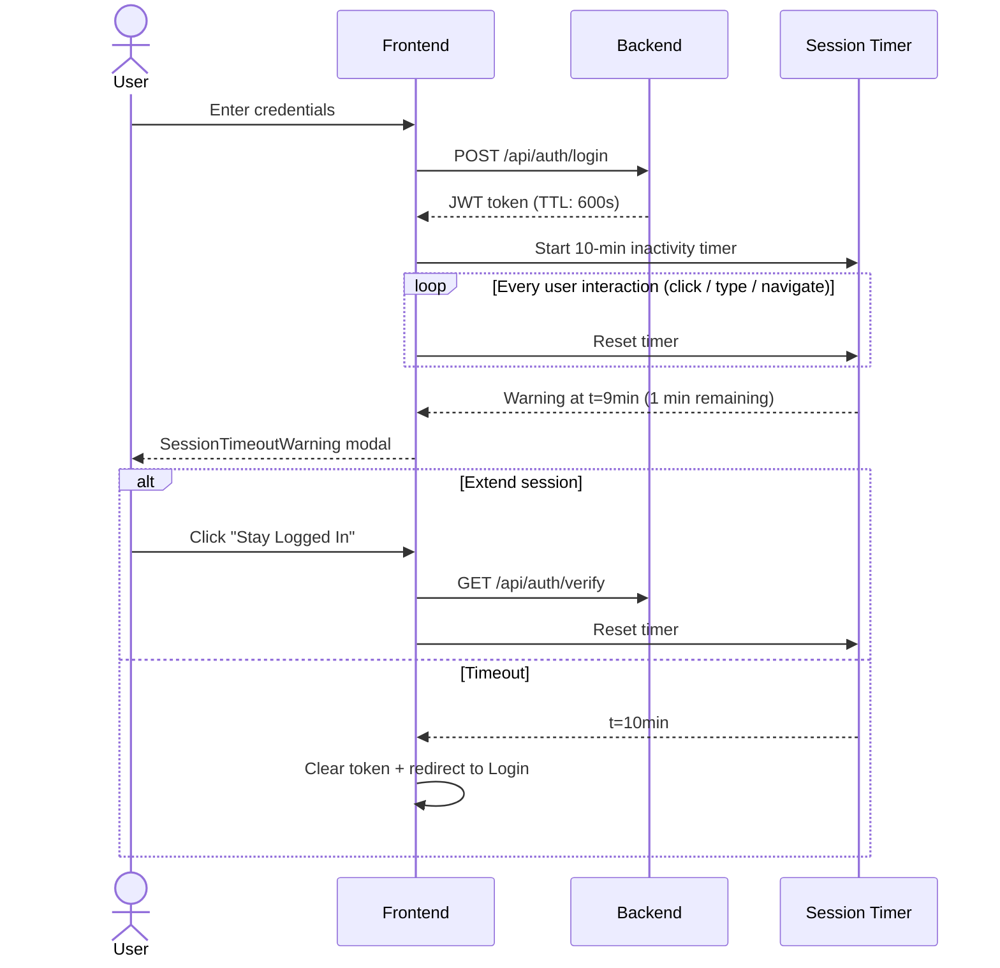
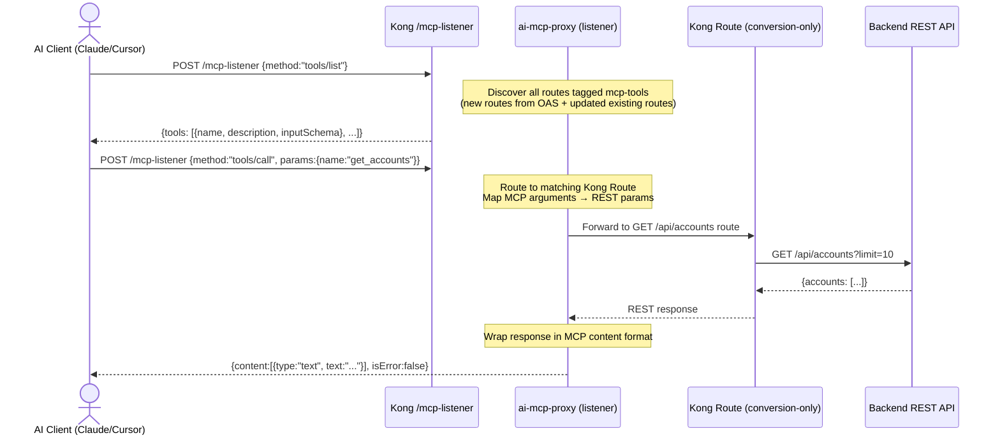

# Any APIs to Kong MCP Servers

> **Powered by Kong Gateway & Kong Konnect**

An enterprise-grade, full-stack automation platform that converts Any REST APIs into AI-native **Model Context Protocol (MCP) servers** on Kong Gateway — accepting either an **OpenAPI specification** or an **existing Kong proxy YAML** as input, and producing Kong configurations with `ai-mcp-proxy` plugins on every route.

---

## Table of Contents

1. [Problem Statement](#1-problem-statement)
2. [Solution: MCPMakerForKong](#2-solution-mcpmakerforkong)
3. [Business Value & Benefits](#3-business-value--benefits)
4. [How Kong MCP Works](#4-how-kong-mcp-works)
5. [High-Level Architecture](#5-high-level-architecture)
6. [How It Works — Flow Diagrams](#6-how-it-works--flow-diagrams)
7. [Platform Tools Overview](#7-platform-tools-overview)
8. [Dual-Input Workflow Detail](#8-dual-input-workflow-detail)
9. [Project Directory Structure](#9-project-directory-structure)
10. [Component Functionality Guide](#10-component-functionality-guide)
11. [Backend REST API Reference](#11-backend-rest-api-reference)
12. [Tech Stack](#12-tech-stack)
13. [AI MCP Proxy Plugin Configuration](#16-ai-mcp-proxy-plugin-configuration)
14. [Testing](#17-testing)

---

## 1. Problem Statement

### The AI-API Integration Gap on Kong

Modern AI assistants (Claude, GPT-4, Cursor, Copilot) use the **Model Context Protocol (MCP)** to discover and invoke external tools and APIs. MCP provides a standardized, AI-native interface over JSON-RPC 2.0.

Enterprises running **Kong Gateway** have two categories of APIs that need MCP enablement:

1. **New APIs** documented as OpenAPI specifications — need Kong config created from scratch with MCP plugins
2. **Existing Kong proxies** already deployed on Kong Gateway / Konnect — need `ai-mcp-proxy` plugins injected into their existing routes

Both categories:
- Speak REST (HTTP + JSON), not MCP JSON-RPC
- Cannot be natively discovered or invoked by AI assistants
- Require significant manual engineering effort to configure Kong's `ai-mcp-proxy` plugin per route
- Have no standard way to expose their capabilities to AI tooling at scale

**The problem**: There is no automated, scalable bridge that covers **both** net-new and existing Kong-managed APIs for AI-native MCP access.

### The Scale of the Problem

| Challenge | Impact |
|-----------|--------|
| 100s of REST APIs per enterprise | Each API requires a Kong Service, Routes, and `ai-mcp-proxy` plugin per method |
| Existing Kong configs | Hundreds of routes already deployed — manually adding plugins to each is infeasible |
| Manual Kong YAML authoring | Hours per API, deep Kong and YAML expertise required |
| `deck` CLI knowledge gap | Validation, sync, and tag-based deployment require specialized skills |
| No standardized tooling | Every team builds custom Kong configs inconsistently |
| Governance risk | Ad-hoc AI integrations bypass Kong Gateway security and observability |

---

## 2. Solution: MCPMakerForKong

**MCPMakerForKong** is an end-to-end automation platform that eliminates this gap for **both input types**. It accepts either an OpenAPI 3.x specification **or** an existing Kong proxy YAML as input, and outputs a fully functional Kong configuration with `ai-mcp-proxy` plugins on every route.

### Two Input Paths, One Output

```
Path A — Net-New APIs:
OpenAPI 3.x Spec  ──►  MCPMakerForKong  ──►  New Kong YAML + MCP Plugins  ──►  Deploy via deck sync
(your OAS file)         (this platform)       (services + routes + plugins)

Path B — Existing Kong Proxies:
Existing Kong YAML ──►  MCPMakerForKong  ──►  Enhanced Kong YAML + MCP Plugins  ──►  Deploy via deck sync
(from Konnect or        (this platform)       (existing routes updated with
 local upload)                                 ai-mcp-proxy plugin)
```

Both paths converge at the same **5-tab workflow**: Upload → Generate/Enhance → Code Viewer → Validate & Deploy → Test.

### How You Get the Existing Kong YAML

For Path B, you can source the existing Kong proxy YAML in two ways:
- **Download from Kong Konnect** — the platform calls `deck gateway dump` using your Konnect credentials, retrieving the live config directly
- **Upload a local file** — drag and drop an existing Kong YAML file you already have on disk

### What Changes on Existing Routes

When MCPMakerForKong processes an existing Kong YAML:
- Every existing **Route** gets an `ai-mcp-proxy` plugin added in `conversion-only` mode
- An optional **listener route** (`/mcp-listener`) is created to aggregate all MCP tools via tag
- No existing Services, Routes, or other plugins are removed or modified
- The output is a drop-in replacement YAML, deployable via `deck sync --select-tag`

---

## 3. Business Value & Benefits

### Time & Cost Savings

| Without MCPMakerForKong | With MCPMakerForKong |
|--------------------------|----------------------|
| Hours per API to author Kong YAML manually | **Minutes per API** |
| Days to retrofit `ai-mcp-proxy` onto 100 existing routes | **Minutes for entire Kong config** |
| Requires Kong + MCP + deck specialist | Any developer can use the UI |
| Inconsistent plugin config across teams | Standardized, validated Kong YAML |
| Manual `deck` commands, error-prone | Automated validate → sync pipeline |

### Strategic Benefits

- **AI Enablement at Scale**: Expose all Kong-managed APIs (new and existing) as AI tools without modifying backend services
- **Zero Backend Changes**: The original REST API remains untouched — Kong acts as the MCP adapter layer
- **Governance Preserved**: All AI tool calls flow through Kong Gateway — full traffic visibility, rate limiting, authentication, and audit logging
- **Security by Default**: Kong's existing security plugins (key-auth, OAuth2, OIDC) continue to protect all AI-originated traffic
- **Existing Config Safe**: Tag-based `deck sync` ensures only this platform's tagged configs are touched; existing untagged routes are unaffected
- **Accelerates AI PoCs**: Teams can go from API spec (or existing Kong config) to AI-accessible MCP tool in under 5 minutes

### ROI Estimate

For an enterprise with 100 APIs across both input types:
- **Before**: 100 APIs × 4 hours manual YAML authoring = ~400 person-hours
- **After**: 100 APIs × 5 minutes via platform = ~8 hours total

---

## 4. How Kong MCP Works

Kong's `ai-mcp-proxy` plugin operates in two modes to convert REST API routes into MCP-accessible tools:

### Conversion Mode (Per-Route)

Each Kong Route — whether newly created from OAS or updated in an existing config — gets an `ai-mcp-proxy` plugin in `conversion-only` mode. When an MCP client calls `tools/call`, Kong translates the MCP JSON-RPC request into the corresponding REST call on that route and converts the REST response back to MCP format.

### Listener Mode (Aggregator Route)

An optional `/mcp-listener` route with `ai-mcp-proxy` in `listener` mode aggregates all MCP tools tagged with `mcp-tools`. AI clients connect to a single endpoint and discover all available tools across all APIs.

```
MCP Client  ──► POST /mcp-listener  ──► Kong ai-mcp-proxy (listener mode)
                                              │
                                              ▼ discovers by tag: mcp-tools
                         ┌────────────────────────────────────────────────┐
                         │  Route: GET /api/accounts                      │
                         │  Plugin: ai-mcp-proxy (conversion-only)        │
                         │                                                │
                         │  Route: POST /api/orders                       │
                         │  Plugin: ai-mcp-proxy (conversion-only)        │
                         │                                                │
                         │  Route: GET /api/users/{id}  ← from existing  │
                         │  Plugin: ai-mcp-proxy (conversion-only) added  │
                         └────────────────────────────────────────────────┘
```

| Mode | Purpose | Endpoint |
|------|---------|----------|
| `conversion-only` | Per-route REST ↔ MCP translation | Individual API routes (new or existing) |
| `listener` | Aggregates all tagged MCP tools | `/mcp-listener` (created by this platform) |

---

## 5. High-Level Architecture



---

## 6. How It Works — Flow Diagrams

### 6.1 Path A — OpenAPI Spec to New MCP Server



### 6.2 Path B — Existing Kong YAML to Enhanced MCP Server



### 6.3 Authentication & Session Flow



### 6.4 Kong MCP Runtime Flow (Both Paths)



---

## 7. Platform Tools Overview

### Tool: Any APIs to Kong MCP Servers ✅ Active

Converts REST API definitions into Kong Gateway MCP servers using the `ai-mcp-proxy` plugin. Supports **two input sources**:

| Input Source | Description | Status |
|---|---|---|
| **OpenAPI Specification** | Upload OAS 3.x files → generate new Kong YAML with MCP plugins | ✅ Active |
| **Existing Kong YAML** | Download from Konnect or upload locally → inject MCP plugins into existing routes | ✅ Active |

**Option 1 — View Existing Kong MCP Servers** *(In Development)*
- Fetch and list Kong proxies that already have `ai-mcp-proxy` plugins deployed in Konnect
- View MCP tool configurations per proxy
- Manage and update existing MCP configurations

**Option 2 — Create / Enhance Kong MCP Servers** *(Active)*
A 5-tab wizard that handles both input sources:
1. **Upload & Validate** — Select source type (OAS or existing Kong YAML), upload or download
2. **Generate / Enhance** — Generate new config (OAS) or inject MCP plugins into existing routes (Kong YAML)
3. **Code Viewer** — Preview generated/enhanced YAML with syntax highlighting
4. **Validate & Deploy** — `deck validate` → optional diff preview → `deck sync`
5. **Test Proxy** — Verify deployed MCP tools *(coming soon)*

---

## 8. Dual-Input Workflow Detail

### Tab 1: Upload & Validate

The source type selector determines the entire downstream flow:

#### Source Type A: OpenAPI Specification

```
┌─────────────────────────────────────────────┐
│ Source Type: ● OpenAPI Spec  ○ Kong YAML    │
├─────────────────────────────────────────────┤
│ [Drag & drop or select .json/.yaml files]   │
│                                             │
│ Validation Results:                         │
│ ┌──────────────┬───────┬───────┬─────────┐  │
│ │ File         │ Title │ Paths │ Status  │  │
│ ├──────────────┼───────┼───────┼─────────┤  │
│ │ accounts.yaml│ Accts │  5    │ ✅ Valid │  │
│ │ trading.yaml │ Trade │  8    │ ✅ Valid │  │
│ │ broken.yaml  │  —    │  —    │ ❌ Error │  │
│ └──────────────┴───────┴───────┴─────────┘  │
└─────────────────────────────────────────────┘
```

**Validation checks performed:**
- OpenAPI 3.0+ format presence
- Required `info.title` and `info.version`
- At least one path defined
- Server URL availability
- Kong compatibility pre-check

#### Source Type B: Existing Kong YAML

```
┌──────────────────────────────────────────────────┐
│ Source Type: ○ OpenAPI Spec  ● Existing Kong YAML│
├──────────────────────────────────────────────────┤
│ Sub-option:                                      │
│ ● Download from Kong Konnect                     │
│   Konnect URL:  [https://eu.api.konghq.com/]     │
│   PAT Token:    [kpat_••••••••••••••••••••••••]  │
│   Control Plane:[kong_dp_konnect            ]    │
│   Tag Filter:   [optional tag to scope dump ]    │
│   [Download Config]                              │
│                                                  │
│ ○ Upload Local File                              │
│   [Select Kong .yaml file]                       │
│   [Upload]                                       │
├──────────────────────────────────────────────────┤
│ Config Summary (after download/upload):          │
│   Format Version: 3.0                            │
│   Services:  4    Routes: 23    Status: ✅ Valid │
└──────────────────────────────────────────────────┘
```

**What happens on download:** The backend runs `deck gateway dump` with your Konnect credentials, saving the live config to `backend/kong_konnect_inputs/`.

**What happens on upload:** The file is validated via `deck validate` and stored in `backend/kong_konnect_inputs/`.

---

### Tab 2: Generate / Enhance

#### For OpenAPI Input — Generate

- Converts each valid OAS file to Kong YAML using `deck openapi2kong`
- Adds `ai-mcp-proxy` plugin (conversion-only) to every generated route
- Optionally creates `/mcp-listener` listener route
- Output: `backend/outputs/kong_configs_{timestamp}/`

**Optional settings:**
- ☑ Create Single MCP Listener Route (`/mcp-listener`)
- ☑ Add OAuth2 Security (adds `openid-connect` or `oauth2-introspection` plugin)
  - Authorization Server URL
  - Introspection Endpoint
  - Client ID / Secret
  - Claim-to-Header mappings

**Result table:**

| OAS File | Kong File | Services | Routes | Plugins |
|----------|-----------|----------|--------|---------|
| accounts.yaml | accounts_kong.yaml | 1 | 12 | 12 |
| trading.yaml | trading_kong.yaml | 1 | 8 | 8 |

#### For Existing Kong YAML Input — Enhance

- Loads the existing Kong YAML (from download or upload)
- Iterates over every Route in the config
- Injects `ai-mcp-proxy` plugin (conversion-only) onto each Route
- Optionally appends a `/mcp-listener` listener route
- Preserves all existing Services, Routes, and other plugins unchanged
- Output: `backend/kong_konnect_outputs/{timestamp}/`

**Result table:**

| Source File | Enhanced File | Routes Updated | Plugins Added | Listener |
|-------------|---------------|---------------|---------------|---------|
| kong_dump.yaml | kong_dump_enhanced.yaml | 23 | 23 | ✅ Added |

---

### Tab 3: Code Viewer

- Select any generated/enhanced Kong YAML from the list
- Syntax-highlighted YAML preview in modal
- Copy to clipboard
- Download all configs as ZIP archive

---

### Tab 4: Validate & Deploy

| Step | Action | Tool |
|------|--------|------|
| **1. Select** | Choose which Kong YAML files to process | UI checkboxes |
| **2. Validate** | Checks Kong YAML syntax and schema | `deck validate` |
| **3. Diff** | Preview what changes will be made (optional) | `deck gateway diff --select-tag` |
| **4. Deploy** | Sync config to Kong Konnect | `deck sync --select-tag AnyAPIsToKongMCPServers` |

The `--select-tag AnyAPIsToKongMCPServers` flag ensures `deck sync` only touches resources tagged by this platform — leaving all other existing Kong configurations untouched.

---

## 9. Project Directory Structure

```
MCPMakerForKong/
├── backend/
│   ├── app.py                              # Flask application + blueprint registration
│   ├── requirements.txt                    # Python dependencies
│   ├── .env                               # Backend environment config (see Section 15)
│   │
│   ├── routes/
│   │   ├── tool1.py                       # Path A: OAS upload → Kong config generation
│   │   ├── kong_konnect.py               # Path B: Existing Kong YAML → MCP enhancement
│   │   ├── auth.py                        # JWT authentication endpoints
│   │   ├── chatbot.py                     # ChatBot routes
│   │   └── ai_decision_gateway.py         # AI Decision Gateway routes
│   │
│   ├── services/
│   │   ├── openapi_validator.py           # OAS validation & metadata extraction
│   │   ├── kong_config_generator.py       # OAS → Kong YAML + ai-mcp-proxy injection
│   │   ├── kong_konnect_service.py        # Existing Kong YAML enhancement + Konnect API
│   │   ├── ai_decision_gateway_service.py # AI routing decision logic
│   │   ├── ai_assistant_service.py        # Strands Agent / AI assistant
│   │   ├── llm_service.py                 # Azure OpenAI / LLM abstraction
│   │   └── tool_gating.py                 # Tool access control
│   │
│   ├── templates/
│   │   └── ai_mcp_proxy_templates.yaml    # Plugin config templates
│   │
│   ├── inputs/                            # Uploaded OAS files (Path A)
│   │   └── {upload_timestamp}/
│   ├── outputs/                           # Generated Kong YAML (Path A)
│   │   └── kong_configs_{timestamp}/
│   ├── kong_konnect_inputs/               # Existing Kong YAML files (Path B input)
│   ├── kong_konnect_outputs/              # Enhanced Kong YAML files (Path B output)
│   │   └── {timestamp}/
│   ├── aidg_inputs/                       # AI Decision Gateway inputs
│   ├── aidg_outputs/                      # AI Decision Gateway outputs
│   └── logs/
│       └── app.log
│
├── frontend/
│   ├── src/
│   │   ├── App.tsx                        # Main React app + router
│   │   ├── components/
│   │   │   ├── Header.tsx                 # Application header
│   │   │   ├── Footer.tsx
│   │   │   ├── Sidebar.tsx                # Tool navigation
│   │   │   ├── ChatBot.tsx
│   │   │   ├── CodeViewer.tsx             # YAML syntax viewer modal
│   │   │   └── SessionTimeoutWarning.tsx  # 10-min session expiry modal
│   │   ├── pages/
│   │   │   ├── Login.tsx
│   │   │   ├── Home.tsx
│   │   │   ├── Tool1.tsx                  # Renders Option 2 workflow
│   │   │   └── Tool1/
│   │   │       ├── Option1.tsx            # View existing MCP proxies (in-dev)
│   │   │       ├── Option2.tsx            # 5-tab workflow (BOTH input paths)
│   │   │       └── Option2/
│   │   │           ├── UploadStep.tsx     # Tab 1: source selector + upload/download
│   │   │           ├── GenerateStep.tsx   # Tab 2: generate (OAS) / enhance (Kong YAML)
│   │   │           ├── DeployStep.tsx     # Tab 4: validate + diff + deploy
│   │   │           └── CodeViewer.tsx     # Tab 3: YAML preview
│   │   └── context/
│   │       └── AuthContext.tsx            # JWT + session timeout management
│   ├── package.json
│   ├── tailwind.config.js                 # Theme configuration
│   └── .env
│
├── Kong_MCP_Marketplace.yaml             # Example: Marketplace API Kong config
├── Kong_MCP_Proxies.yaml                 # Example: Additional proxy configs
├── ARCHITECTURE.md
├── INSTALLATION.md
├── API_REFERENCE.md
└── README.md
```

---

## 10. Component Functionality Guide

### 10.1 OpenAPI Validator (`services/openapi_validator.py`)

Validates uploaded OpenAPI specs before Kong config generation (Path A only).

| Check | Description |
|-------|-------------|
| Required fields | Validates `openapi`, `info`, `paths` |
| Version | Confirms OpenAPI 3.0+ |
| Info fields | Verifies `title` and `version` |
| Server URL | Extracts base server URL for Kong Service upstream |
| Operations | Counts paths and HTTP method operations |
| Kong compatibility | Pre-checks for incompatible patterns |

### 10.2 Kong Config Generator (`services/kong_config_generator.py`)

**Path A** — Converts validated OAS files into Kong 3.0 YAML with `ai-mcp-proxy` plugins.

**Generation logic per OAS file:**

```
OAS File
  │
  ├── deck openapi2kong → temp Kong YAML
  │
  └── _add_ai_mcp_plugins_to_kong_config()
        │
        ├── 1 Kong Service  (name: {title}-service, url: {server.url})
        │
        └── For each path + method:
              1 Kong Route
                └── ai-mcp-proxy plugin (conversion-only)
                      description: {operation.summary}
                      method, path, parameters, requestBody, responses
                      tags: [AnyAPIsToKongMCPServers, mcp-tools, KONG_SERVICE_NAME_{svc}]

Optional: _generate_listener_config()
  └── /mcp-listener route with ai-mcp-proxy (listener mode)
        tag: mcp-tools, timeout: 45000
```

### 10.3 Kong Konnect Service (`services/kong_konnect_service.py`)

**Path B** — Handles existing Kong YAML input: download, upload, enhance, deploy.

| Method | Description |
|--------|-------------|
| `download_config()` | Runs `deck gateway dump` with Konnect credentials |
| `upload_and_validate()` | Validates uploaded Kong YAML via `deck validate` |
| `enhance_with_mcp_plugins()` | Injects `ai-mcp-proxy` onto every existing Route |
| `validate_configs()` | Runs `deck validate` on enhanced files |
| `diff_configs()` | Runs `deck gateway diff --select-tag` |
| `deploy_configs()` | Runs `deck sync --select-tag AnyAPIsToKongMCPServers` |

**Enhancement logic (existing Kong YAML):**

```
Existing Kong YAML
  │
  └── For EACH Route in yaml['routes'] (or service.routes):
        Add plugin:
          name: ai-mcp-proxy
          config:
            mode: conversion-only
            tools:
              - method: {route.methods[0]}
                path: {route.paths[0]}
                description: auto-generated or from tags
          tags: [AnyAPIsToKongMCPServers, mcp-tools]

Optional: Append /mcp-listener route (listener mode)
```

### 10.4 LLM Service (`services/llm_service.py`)

Abstraction over LLM providers for AI-assisted operations.

| Provider | Config Variables |
|----------|-----------------|
| Azure OpenAI (default) | `AZURE_OPENAI_API_KEY`, `AZURE_OPENAI_ENDPOINT`, `AZURE_OPENAI_DEPLOYMENT_NAME` |
| OpenAI | `OPENAI_API_KEY` |
| Google Gemini | `GEMINI_API_KEY` |

### 10.5 Auth Service (`routes/auth.py`)

| Credential | Username | Password |
|-----------|----------|----------|
| Demo | `demo` | `demo123` |
| Admin | `admin` | `admin123` |

JWT tokens expire after 600 seconds. Frontend auto-resets the inactivity timer on every user interaction.

---

## 11. Backend REST API Reference

All endpoints require `Authorization: Bearer {jwt_token}` unless noted.

### Authentication

```
POST /api/auth/login       — Login, returns JWT
GET  /api/auth/verify      — Verify / refresh token
POST /api/auth/logout      — Invalidate session
```

---

### Path A: OAS → Kong MCP (Tool 1 Endpoints)

Base: `/api/mcp-servers`

#### Upload & Validate OpenAPI Specs
```
POST /api/mcp-servers/upload-openapi
Content-Type: multipart/form-data

files: [accounts.yaml, trading.json, ...]
```
**Response:**
```json
{
  "status": "success",
  "upload_dir": "inputs/1710000000",
  "validation": {
    "valid_count": 2,
    "invalid_count": 1,
    "results": {
      "valid": [
        {"filename": "accounts.yaml", "title": "Accounts API",
         "version": "1.0.0", "server_url": "https://api.example.com",
         "paths_count": 5, "operations_count": 12}
      ],
      "invalid": [
        {"filename": "broken.yaml", "error": "Missing required field: info.title"}
      ]
    }
  }
}
```

#### Generate Kong Configurations
```
POST /api/mcp-servers/generate
Content-Type: application/json

{
  "create_single_mcp_server": true,
  "oauth2_config": {
    "enabled": false,
    "authorization_server_url": "",
    "introspection_endpoint": "",
    "client_id": "",
    "client_secret": ""
  }
}
```
**Response:**
```json
{
  "status": "success",
  "output_dir": "outputs/kong_configs_1710000000",
  "kong_files": [
    {
      "oas_filename": "accounts.yaml",
      "kong_filename": "accounts_kong.yaml",
      "kong_filepath": "/path/to/outputs/.../accounts_kong.yaml",
      "services_count": 1,
      "routes_count": 12,
      "plugins_count": 12
    }
  ],
  "listener_created": true
}
```

#### Get Kong Config Content
```
GET /api/mcp-servers/get-config
POST /api/mcp-servers/get-config     { "filepath": "/path/to/file.yaml" }
```

#### Preview Diff Before Deployment
```
POST /api/mcp-servers/diff
Content-Type: application/json

{ "kong_files": ["/path/to/accounts_kong.yaml"] }
```
**Response:**
```json
{
  "results": [
    {
      "filename": "accounts_kong.yaml",
      "diff": {
        "creating": 13,
        "updating": 0,
        "deleting": 0,
        "unchanged": 0
      }
    }
  ]
}
```

#### Validate Kong Configs
```
POST /api/mcp-servers/validate
Content-Type: application/json

{ "kong_files": ["/path/to/accounts_kong.yaml"] }
```

#### Deploy to Kong Konnect
```
POST /api/mcp-servers/deploy
Content-Type: application/json

{ "kong_files": ["/path/to/accounts_kong.yaml"] }
```

#### Download as ZIP
```
POST /api/mcp-servers/download
Content-Type: application/json

{ "output_dir": "outputs/kong_configs_1710000000" }
```

---

### Path B: Existing Kong YAML → Enhanced MCP (Kong Konnect Endpoints)

Base: `/api/kong-konnect`

#### Download Existing Kong Config from Konnect
```
POST /api/kong-konnect/download-config
Content-Type: application/json

{
  "konnect_addr": "https://eu.api.konghq.com/",
  "konnect_token": "kpat_...",
  "control_plane_name": "kong_dp_konnect",
  "select_tag": "optional-tag-filter"
}
```
**Response:**
```json
{
  "status": "success",
  "file_path": "kong_konnect_inputs/kong_dump_1710000000.yaml",
  "content": "...",
  "summary": {
    "services_count": 4,
    "routes_count": 23,
    "format_version": "3.0",
    "is_valid": true
  }
}
```

#### Upload Existing Kong YAML File
```
POST /api/kong-konnect/upload-kong-config
Content-Type: multipart/form-data

file: existing_kong.yaml
```
**Response:**
```json
{
  "status": "success",
  "file_path": "kong_konnect_inputs/existing_kong_1710000000.yaml",
  "summary": {
    "services_count": 4,
    "routes_count": 23,
    "format_version": "3.0",
    "is_valid": true
  }
}
```

#### Enhance Existing Routes with MCP Plugins
```
POST /api/kong-konnect/enhance-with-mcp
Content-Type: application/json

{
  "source_file": "kong_konnect_inputs/kong_dump_1710000000.yaml",
  "create_listener_route": true,
  "oauth2_config": { "enabled": false }
}
```
**Response:**
```json
{
  "status": "success",
  "enhanced_file": "kong_konnect_outputs/1710000000/kong_dump_enhanced.yaml",
  "routes_updated": 23,
  "plugins_added": 23,
  "listener_created": true
}
```

#### Validate Enhanced Configs
```
POST /api/kong-konnect/validate
Content-Type: application/json

{ "kong_files": ["kong_konnect_outputs/1710000000/kong_dump_enhanced.yaml"] }
```

#### Preview Diff
```
POST /api/kong-konnect/diff
Content-Type: application/json

{ "kong_files": ["kong_konnect_outputs/1710000000/kong_dump_enhanced.yaml"] }
```

#### Deploy Enhanced Config
```
POST /api/kong-konnect/deploy
Content-Type: application/json

{ "kong_files": ["kong_konnect_outputs/1710000000/kong_dump_enhanced.yaml"] }
```

---

## 12. Tech Stack

### Frontend

| Component | Technology | Version |
|-----------|-----------|---------|
| Framework | React | 19.2.4 |
| Language | TypeScript | 4.9.5 |
| Styling | Tailwind CSS | 3.4.3 |
| Icons | Lucide React | 0.564.0 |
| Routing | react-router-dom | 7.13.0 |
| HTTP Client | Axios | 1.13.5 |
| Build | react-scripts | 5.0.1 |
| Branding | Custom palette + logo + favicon | — |

### Backend

| Component | Technology | Version |
|-----------|-----------|---------|
| Framework | Flask | 3.0.0 |
| Language | Python | 3.9+ |
| YAML | PyYAML | ≥ 6.0.1 |
| JSON Schema | jsonschema | 4.20.0 |
| CORS | Flask-CORS | 4.0.0 |
| Config | python-dotenv | 1.0.0 |
| OAS Validation | openapi-spec-validator | 0.7.1 |
| LLM | openai | ≥ 0.27.0 |
| Auth | PyJWT | 2.11.0 |
| HTTP | requests + httpx | latest |
| AI Agent | strands-agents | latest |
| MCP | mcp | latest |
| Logging | python-json-logger | 2.0.7 |
| Production | gunicorn | 21.2.0 |

### Gateway & Deployment

| Component | Technology |
|-----------|-----------|
| API Gateway | Kong Gateway (Data Plane) |
| Enterprise Management | Kong Konnect (Control Plane) |
| Config Deployment | deck CLI (`validate` + `diff` + `sync` + `gateway dump`) |
| MCP Plugin | `ai-mcp-proxy` (Kong native plugin) |
| Config Format | Kong YAML 3.0 |
| Tag-based Deployment | `--select-tag AnyAPIsToKongMCPServers` |

---

## 13. AI MCP Proxy Plugin Configuration

### Conversion Mode — Applied to Every Route (Both Paths)

```yaml
plugins:
  - name: ai-mcp-proxy
    instance_name: ai-mcp-proxy-{service}-{path}-{method}
    enabled: true
    tags:
      - AnyAPIsToKongMCPServers
      - mcp-tools
      - KONG_SERVICE_NAME_{service-name}
    config:
      mode: conversion-only
      tools:
        - description: "Get list of user accounts"
          method: GET
          path: /api/accounts
          parameters:
            - name: limit
              in: query
              required: false
              schema:
                type: integer
          requestBody: {}
          responses:
            "200":
              description: "List of accounts"
              content:
                application/json:
                  schema:
                    type: array
```

> **For existing Kong YAML (Path B):** The `method` and `path` values are extracted from the existing Route's `methods[]` and `paths[]` arrays. The `description` is either derived from existing route tags or auto-generated.

### Listener Mode — One per Generation Run

```yaml
routes:
  - name: mcp-listener-route
    paths:
      - /mcp-listener
    strip_path: false
    plugins:
      - name: ai-mcp-proxy
        enabled: true
        tags:
          - AnyAPIsToKongMCPServers
          - mcp-tools
        config:
          mode: listener
          server:
            tag: mcp-tools
            timeout: 45000
          logging:
            log_statistics: true
            log_payloads: false
          max_request_body_size: 32768
```

### Plugin Defaults

| Parameter | Default |
|-----------|---------|
| `timeout` | `45000` ms |
| `max_request_body_size` | `32768` bytes (32KB) |
| `log_statistics` | `true` |
| `log_payloads` | `false` |

### Tag Strategy

| Tag | Purpose |
|-----|---------|
| `AnyAPIsToKongMCPServers` | Scopes `deck sync` — only this platform's configs are touched |
| `mcp-tools` | Used by listener route to discover all MCP tools |
| `KONG_SERVICE_NAME_{name}` | Service-level grouping |

---

## 14. Testing

### Reference Configuration Files

- **`Kong_MCP_Marketplace.yaml`** — Example marketplace API with MCP plugins
- **`Kong_MCP_Proxies.yaml`** — Additional proxy examples including listener route

### Path A: Manual Test with Sample OpenAPI

```yaml
openapi: 3.0.0
info:
  title: Test API
  version: 1.0.0
servers:
  - url: https://api.example.com
paths:
  /users:
    get:
      summary: Get all users
      parameters:
        - name: limit
          in: query
          schema: { type: integer }
      responses:
        '200': { description: Users list }
  /users/{id}:
    get:
      summary: Get user by ID
      parameters:
        - name: id
          in: path
          required: true
          schema: { type: string }
      responses:
        '200': { description: User object }
```

Upload through the UI → Generate → Validate → Deploy.

### Path B: Manual Test with Existing Kong YAML

1. Take the generated output from Path A (or use `Kong_MCP_Marketplace.yaml`)
2. In Tab 1, select **"Existing Kong YAML"** → **"Upload Local File"**
3. Upload the YAML → verify route count in summary
4. Tab 2: Enhance → verify `routes_updated` matches route count
5. Tab 3: View the enhanced YAML — every route should have `ai-mcp-proxy` plugin
6. Tab 4: Validate → Diff → Deploy

### Automated Tests

```bash
# E2E tests (covers both input paths)
python test_e2e.py
python test_e2e_simple.py

# Integration tests
python test_integration.py

# Path parameter handling
python test_path_params.py

# Tag-based deployment verification
python test_verify_select_tags.py

# Unit tests
cd backend && python -m pytest tests/
```

### deck CLI Manual Commands

```bash
# Validate (both paths)
deck validate --state backend/outputs/kong_configs_.../accounts_kong.yaml
deck validate --state backend/kong_konnect_outputs/.../kong_dump_enhanced.yaml

# Diff preview before deploy
deck gateway diff \
  --state backend/kong_konnect_outputs/.../kong_dump_enhanced.yaml \
  --konnect-addr https://eu.api.konghq.com/ \
  --konnect-token kpat_... \
  --select-tag AnyAPIsToKongMCPServers

# Deploy
deck sync \
  --state backend/kong_konnect_outputs/.../kong_dump_enhanced.yaml \
  --konnect-addr https://eu.api.konghq.com/ \
  --konnect-token kpat_... \
  --select-tag AnyAPIsToKongMCPServers

# Download existing config from Konnect (Path B source)
deck gateway dump \
  --konnect-addr https://eu.api.konghq.com/ \
  --konnect-token kpat_... \
  --output existing_kong.yaml
```

---


## References

- [Kong AI MCP Proxy Plugin](https://developer.konghq.com/plugins/ai-mcp-proxy/reference/)
- [Kong Konnect Documentation](https://docs.konghq.com/konnect/)
- [deck CLI Documentation](https://docs.konghq.com/deck/)
- [OpenAPI 3.0 Specification](https://swagger.io/specification/)
- [Model Context Protocol (MCP)](https://modelcontextprotocol.io/)
- [Azure OpenAI Service](https://learn.microsoft.com/en-us/azure/ai-services/openai/)

---

> **Version:** 1.1.0 | **Last Updated:** April 2026 | **Status:** Tool 1 (Both Input Paths) Active · Tools 2–5 In Development
